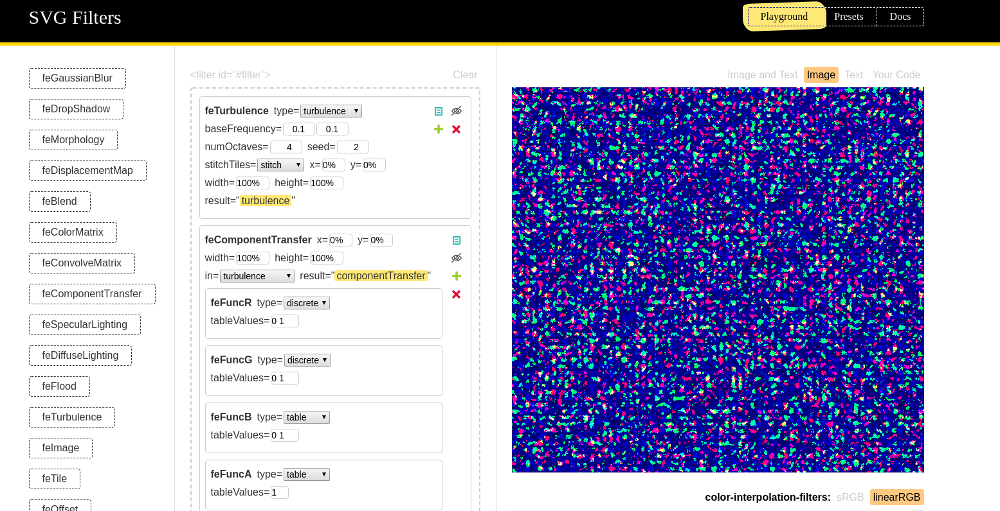
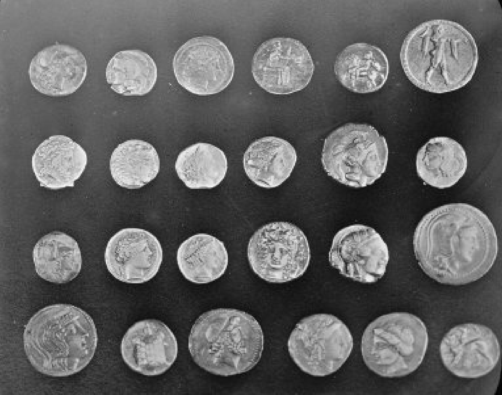
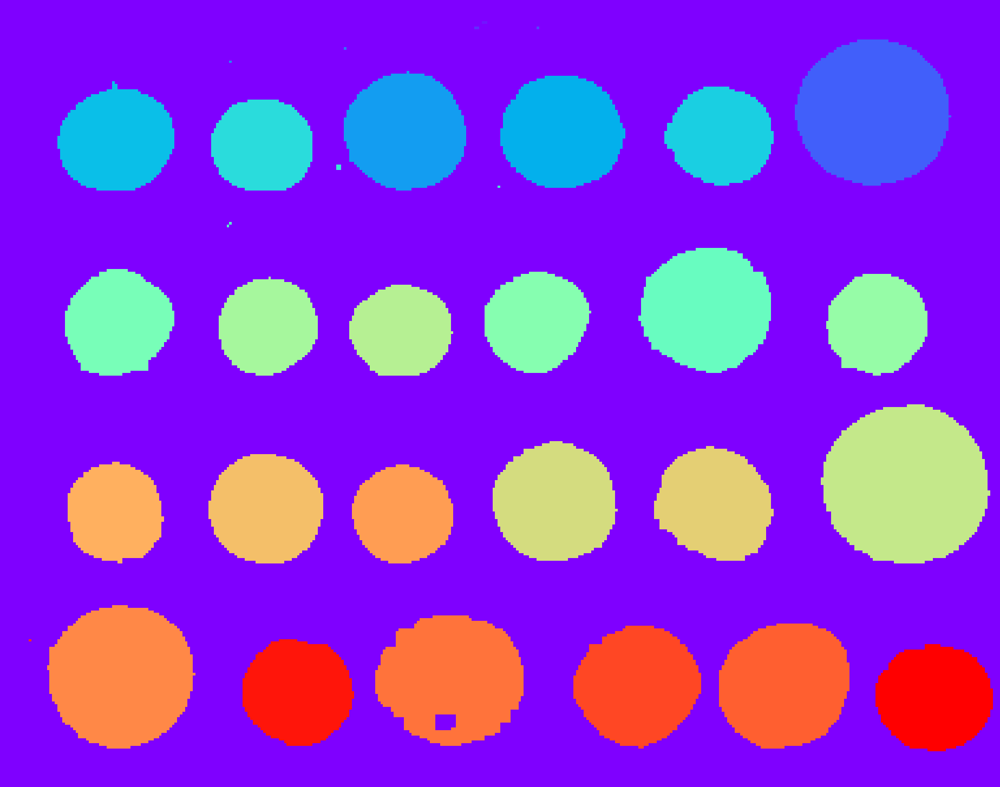
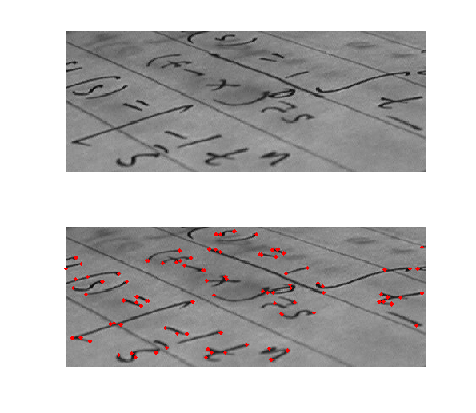

import '@babel/polyfill';

export {default as theme} from './theme';
import {Head, Appear} from 'mdx-deck';
import ImagesAsFunctions from './slides/ImagesAsFunctions';
import Channels from './slides/Channels';
import MindMap from './slides/MindMap';
import {default as fullMindMap, shallow, ImageProcessing} from './mindMap.js';
import {P, A, LI} from 'components/basic';

<Head>
  <title>Computer vision basics on the Web</title>
  <link
    href="https://fonts.googleapis.com/css?family=Roboto+Slab"
    rel="stylesheet"
  />
  <link
    rel="stylesheet"
    href="https://use.fontawesome.com/releases/v5.7.2/css/all.css"
    integrity="sha384-fnmOCqbTlWIlj8LyTjo7mOUStjsKC4pOpQbqyi7RrhN7udi9RwhKkMHpvLbHG9Sr"
    crossOrigin="anonymous"
  />
</Head>

# Computer&nbsp;vision basics on&nbsp;the&nbsp;Web

  <small>by Paolo Bueno</small>
   
  <A href="http://linkedin.com/in/paolobueno">
    <i className="fab fa-linkedin" />
  </A>{' '}
  <A href="https://github.com/paolobueno">
    <i className="fab fa-github" />
  </A>

---

# Why?

<Appear>
  
Explore newer Web APIs

  
Computer vision is a great intro to AI and ML

</Appear>

---

# Web technology primer

<Appear>Filters!</Appear>

---

import CSSFilters from './slides/CSSFilters';

## CSS filters

<CSSFilters />

---

## SVG filters

---

# Computer vision

<ol>
  <Appear>
    <LI>
      <b>Image Processing</b>
    </LI>
    <LI>Feature Extraction</LI>
    <LI style={{color: '#aaa'}}>Recognition</LI>
  </Appear>
</ol>

---

# Machine Learning

<ol>
  <LI>
    <b>Pre-processing</b>
  </LI>
  <LI>Dimensionality Reduction</LI>
  <LI style={{color: '#aaa'}}>Classification/Clustering</LI>
</ol>

---

<MindMap map={fullMindMap} width={1300} height={1000} />

---

# What is an image?

---

## Images are many channels

<Channels src="assets/lenna.png" />

---

## Images are arrays

import ImagesAsArrays from './slides/ImagesAsArrays';

<ImagesAsArrays src="assets/lenna_small.png" />

---

## Images are (continous) functions of space

<ImagesAsFunctions />

---

# Image Processing

---

<MindMap map={fullMindMap} width={1300} height={1000} highlight={'Image Processing'} />

---

<MindMap
  map={ImageProcessing}
  width={1200}
  height={800}
  minLabelSize={2}
  highlight={'Convolutions'}
/>

---

## Convolutions

---

import Convolution from './slides/Convolution';

## Convolutions

<Convolution src="assets/cameraman.png" baseWidth={384} baseHeight={384} />

---

<MindMap
  map={ImageProcessing}
  width={1200}
  height={800}
  minLabelSize={2}
  highlight={'Thresholding'}
/>

---

import Grayscaling from 'slides/Grayscaling';

## Thresholding

<Grayscaling src="assets/segmentation1.png" width={600} height={400} />

---

<MindMap
  map={ImageProcessing}
  width={1200}
  height={800}
  minLabelSize={2}
  highlight={'Morphology'}
/>

---

## Morphology

  

    
Erosion ⊖

    
  

  

    
Dilation ⊕

    
  

  

    
Opening ⊕ ∘ ⊖

    
  

  

    
Closing ⊖ ∘ ⊕

    
  

---

## Morphology

import Morphology from 'slides/Morphology';

<Morphology
  src="assets/segmentation1.png"
  style={{width: '60vw', height: '60vh'}}
/>

---

<MindMap map={fullMindMap.children[1]} width={800} height={700} />

---

# Feature Extraction

<Appear>
  
"Are these pixels showing a church?"

  
"Is something square with a pointy end, a church?"

</Appear>

---

## Feature descriptors

---

## Connected Components

---

## Corner detection

---

# Thank you!

[http://paolobueno.com/im-presentation/](http://paolobueno.com/im-presentation/)

---

## More Image Processing

- [Image and video processing @ Coursera](https://www.coursera.org/learn/image-processing)
- [OpenCV](https://opencv.org/)
- [MDN Canvas API](https://developer.mozilla.org/en-US/docs/Web/API/Canvas_API)
- [SVG Filters Playground](https://yoksel.github.io/svg-filters/)
- [JuliaImages](https://juliaimages.org/latest/)
- [GNU Octave - MATLAB as in beer](https://www.gnu.org/software/octave/)

---

## More AI & ML

- [Google ML crash courses](https://developers.google.com/machine-learning/)
- [Andrew Ng's ML course](https://www.coursera.org/learn/machine-learning)
- [making of Not Hotdog](https://medium.com/@timanglade/how-hbos-silicon-valley-built-not-hotdog-with-mobile-tensorflow-keras-react-native-ef03260747f3)
- [Kaggle](https://www.kaggle.com/)
- [Tensorflow JS](https://www.tensorflow.org/)
- [Webgazer JS](https://webgazer.cs.brown.edu/)

---

Segmentation example ©
[Cyrille Rossant @ IPython Cookbook](https://ipython-books.github.io/113-segmenting-an-image/)

Convolution animation ©
[Paul-Louis Prove](https://towardsdatascience.com/types-of-convolutions-in-deep-learning-717013397f4d)

Mercado De La Boqueria, Barcelona, Spain
[on unsplash](https://unsplash.com/photos/-gOUx23DNks)

Template matching example ©
[scikit-image team](http://scikit-image.org/docs/dev/auto_examples/features_detection/plot_template.html)

This presentation © Paolo Bueno, CC BY 4.0
