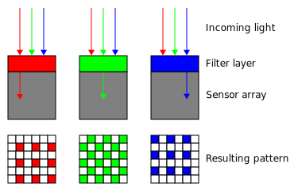
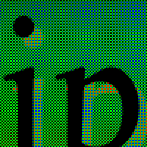
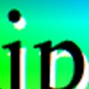
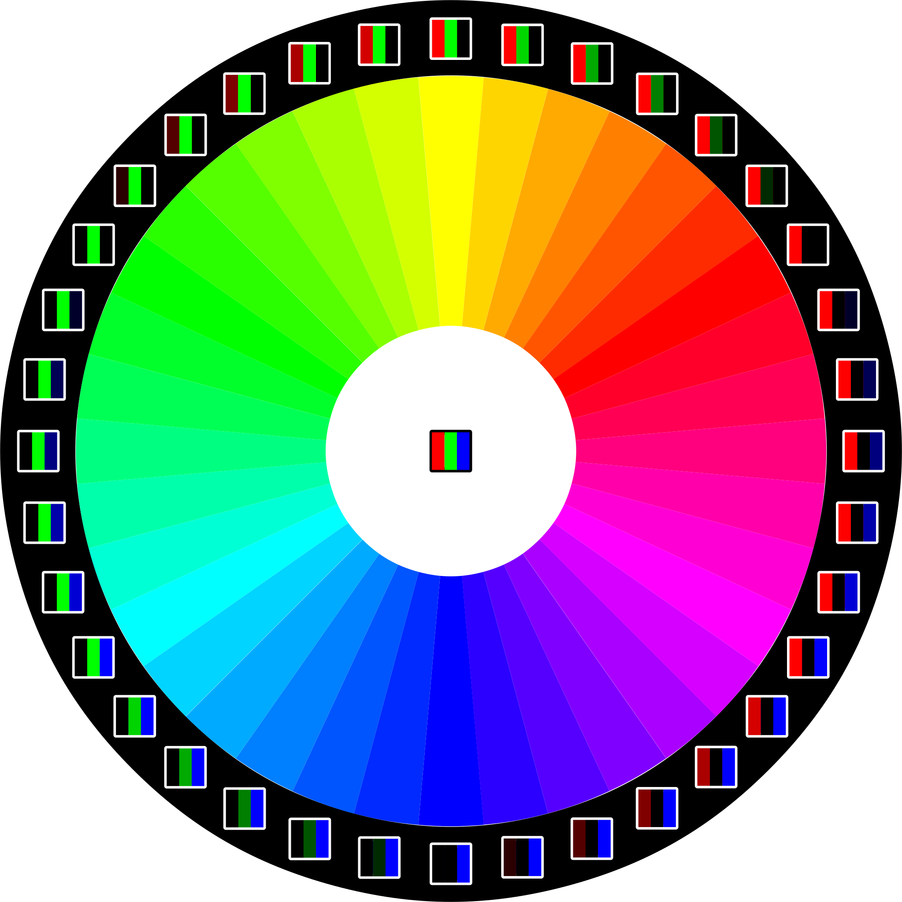
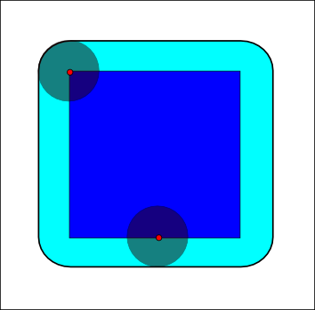

import '@babel/polyfill';

export {default as theme} from './theme';
import {Head, Appear} from 'mdx-deck';
import ImagesAsFunctions from './slides/ImagesAsFunctions';
import Channels from './slides/Channels';

<Head>
  <title>Computer vision basics on the Web</title>
  <link href="https://fonts.googleapis.com/css?family=Roboto+Slab" rel="stylesheet" />
</Head>

# Computer&nbsp;vision basics on&nbsp;the&nbsp;Web

---

# What is computer vision?

- Image acquisition 📷
- **Pre-processing**
- **Feature extraction**
- Segmentation
- Recognition
- Decision-making

---

# Image acquisition

---

## Demosaicing

---

# Image display

---

## Images as arrays

import ImagesAsArrays from './slides/ImagesAsArrays';

<ImagesAsArrays src="assets/lenna_small.png" />

---

## Images as functions of space

<ImagesAsFunctions />

---

# Image Processing

---

## Channels

<Channels src="assets/lenna.png" />

---

import Grayscaling from 'slides/Grayscaling';

## Grayscaling and Thresholding

<Grayscaling src="assets/dark_windows_eq.jpg" width={600} height={400} />

---

## Morphology

---

  

    
Erosion ⊖

    
  

  

    
Dilation ⊕

    
  

  

    
Opening (⊕ ∘ ⊖)

    
  

  

    
Closing (⊖ ∘ ⊕)

    
  

---

import Morphology from 'slides/Morphology';

<Morphology src="assets/dark_windows_eq.jpg" style={{width: '60vw', height: '60vh'}} />

---

import Convolution from './slides/Convolution';

<Convolution src="assets/lenna_small.png" baseWidth={384} baseHeight={384} />

---

# Segmentation

---

# Recognition

---

## More Image processing

- [Image and video processing @ Coursera](https://www.coursera.org/learn/image-processing)
- [OpenCV](https://opencv.org/)
- [MDN Canvas API](https://developer.mozilla.org/en-US/docs/Web/API/Canvas_API)
- [SVG Filters Playground](https://yoksel.github.io/svg-filters/)

---

## More AI & Machine learning

- [Google ML crash courses](https://developers.google.com/machine-learning/)
- [Andrew Ng's ML course](https://www.coursera.org/learn/machine-learning)
- [making of Not Hotdog](https://medium.com/@timanglade/how-hbos-silicon-valley-built-not-hotdog-with-mobile-tensorflow-keras-react-native-ef03260747f3)
- [Kaggle](https://www.kaggle.com/)
- [Tensorflow JS](https://www.tensorflow.org/)
- [Webgazer JS](https://webgazer.cs.brown.edu/)

---

## References
