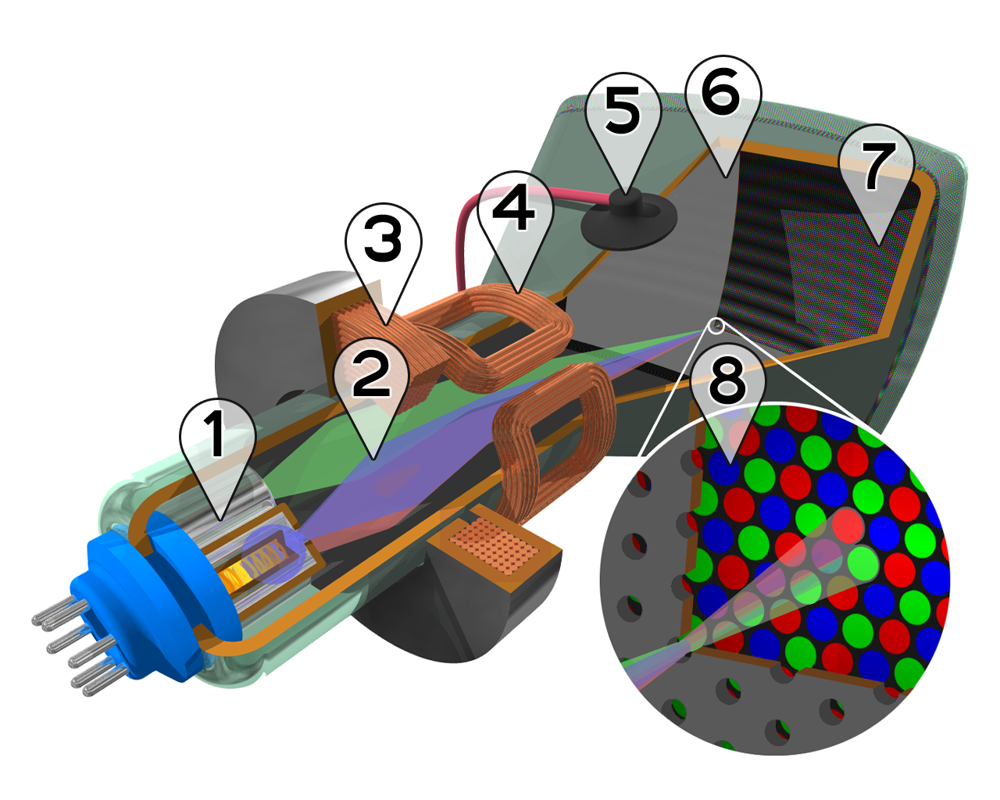

export {default as theme} from './theme';
import {Head, Appear} from 'mdx-deck';
import {Invert, Split} from 'mdx-deck/layouts';
import ImagesAsFunctions from './slides/ImagesAsFunctions';
import Channels from './slides/Channels';

<Head>
  <title>Computer vision basics on the Web</title>
  <link href="https://fonts.googleapis.com/css?family=Roboto+Slab" rel="stylesheet" />
</Head>

export default Invert;

# Computer&nbsp;vision basics on&nbsp;the&nbsp;Web

---

# What is computer vision?

- Image acquisition 📷
- **Pre-processing**
- **Feature extraction**
- Segmentation
- Recognition
- Decision-making

---

# Image acquisition

---

## Demosaicing

---

# Image display

---

## Images as arrays

import ImagesAsArrays from './slides/ImagesAsArrays';

<ImagesAsArrays src="assets/lenna_small.png" />

---

## Images as functions of space

<ImagesAsFunctions />

---

export default Invert;

# Image Processing

---

## Channels

<Channels src="assets/lenna.png" />

---

import Grayscaling from 'slides/Grayscaling';

## Grayscaling and Thresholding

<Grayscaling src="assets/building_donuts.jpg" width={600} height={400} />

---

import Morphology from 'slides/Morphology';

## Morphology

<Morphology src="assets/building_donuts.jpg" style={{width: '60vw', height: '60vh'}} />

---

1. Morphology
1. Convolution
1. Template Matching
1. Applications
1. What next?

---
